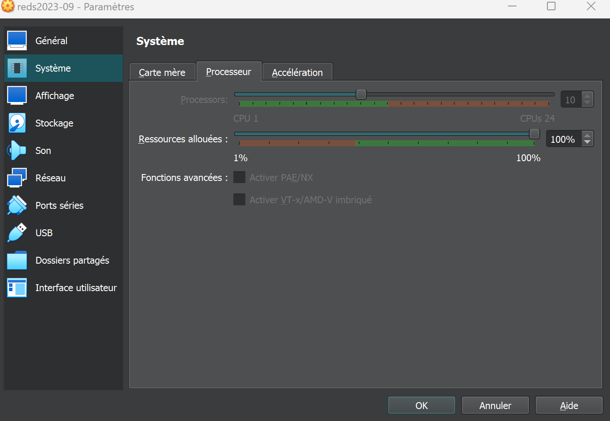

# Labo 01 - Miguel Jalube

## Architecture

Utilisation de la VM reds avec les configs suivantes :

PC : Lenovo yoga 7
Processeur	12th Gen Intel(R) Core(TM) i7-1260P, 2100 MHz, 12 cœur(s), 16 processeur(s) logique(s)
16 Go de RAM

## Mesure des temps d'exécution

### Tableau de mesures
| Image source | Temps 1D [s] | Temps chained [s] | Résolution |
|--------------|----------------------|--------------------------|----------------|
| nyc.png | 0.08 | 10.25 | 1150x710 |
| medalion.png | 0.07 | 16.93 | 1267x919 |
| half-life.png | 0.17 | 90.56 | 2000x2090 |
| rageart_jin.png | 0.13 | 62.77 | 1916x1080 |
| winged_jin.png | 0.12 | 58.32 | 1920x1080 |

### Analyse des résultats
Les resultats obtenus montrent que l'utilisation de tableaux 1D donne des biens meilleurs resultats que l'utilisation de listes chainées. 

Note : Les mesures ont été faites avec /usr/bin/time.

## Conclusion
Globalement, il y a deux raisons qui expliquent le fait que les tableaux soient plus rapides que les listes chainées :
- La méthode d'accès aux données
- La localité spatiale des données

Pour la méthode d'accès, un tableau utilise des accès aléatoire tandis qu'une liste chainée ne permet qu'un accès séquentiel qui est bien plus lent. Les raisons de ceci sont les suivantes :
- L'accès sequentiel oblige a accèder a tous les pixels précédents pour accéder a un pixel donné.
- L'accès aléatoire permet d'accéder directement a un pixel donné.

Pour ce qui est de la localité spatiale des données, un tableau 1D exploite la localité spatiale des pixels, ce qui n'est pas le cas pour une liste chainée. Ceci est aussi une des raisons pour laquelle les tableaux 1D sont plus rapides que les listes chainées pour ce genre de problèmes.