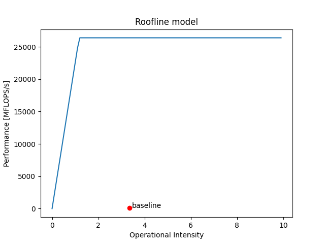
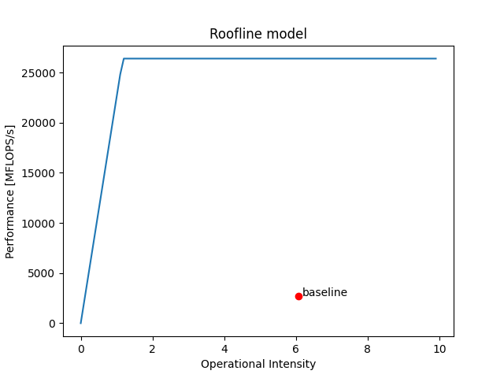

# Labo 2 Miguel Jalube
# PC fixe maison
## Topology
```bash
miguel@miguel-ROG-Strix-GA15DH-G15DH:~/Bureau/HPC$ likwid-topology
--------------------------------------------------------------------------------
CPU name:       AMD Ryzen 7 3700X 8-Core Processor             
CPU type:       AMD K17 (Zen2) architecture
CPU stepping:   0
********************************************************************************
Hardware Thread Topology
********************************************************************************
Sockets:                1
Cores per socket:       8
Threads per core:       2
--------------------------------------------------------------------------------
HWThread        Thread          Core            Socket          Available
0               0               0               0               *
1               0               1               0               *
2               0               2               0               *
3               0               3               0               *
4               0               4               0               *
5               0               5               0               *
6               0               6               0               *
7               0               7               0               *
8               1               0               0               *
9               1               1               0               *
10              1               2               0               *
11              1               3               0               *
12              1               4               0               *
13              1               5               0               *
14              1               6               0               *
15              1               7               0               *
--------------------------------------------------------------------------------
Socket 0:               ( 0 8 1 9 2 10 3 11 4 12 5 13 6 14 7 15 )
--------------------------------------------------------------------------------
********************************************************************************
Cache Topology
********************************************************************************
Level:                  1
Size:                   32 kB
Cache groups:           ( 0 8 ) ( 1 9 ) ( 2 10 ) ( 3 11 ) ( 4 12 ) ( 5 13 ) ( 6 14 ) ( 7 15 )
--------------------------------------------------------------------------------
Level:                  2
Size:                   512 kB
Cache groups:           ( 0 8 ) ( 1 9 ) ( 2 10 ) ( 3 11 ) ( 4 12 ) ( 5 13 ) ( 6 14 ) ( 7 15 )
--------------------------------------------------------------------------------
Level:                  3
Size:                   16 MB
Cache groups:           ( 0 8 1 9 2 10 3 11 ) ( 4 12 5 13 6 14 7 15 )
--------------------------------------------------------------------------------
********************************************************************************
NUMA Topology
********************************************************************************
NUMA domains:           1
--------------------------------------------------------------------------------
Domain:                 0
Processors:             ( 0 8 1 9 2 10 3 11 4 12 5 13 6 14 7 15 )
Distances:              10
Free memory:            8803.57 MB
Total memory:           15913.4 MB
--------------------------------------------------------------------------------
```

## Roofline model
### maxperf et maxband
```bash
miguel@miguel-ROG-Strix-GA15DH-G15DH:~/Bureau/HPC$ likwid-bench -t load -W N:2GB:36 | grep -E 'MByte/s'
Running without Marker API. Activate Marker API with -m on commandline.
MByte/s:                22132.87
miguel@miguel-ROG-Strix-GA15DH-G15DH:~/Bureau/HPC$ likwid-bench -t peakflops -W N:360kB:36 | grep -E 'MFlops/s'
Running without Marker API. Activate Marker API with -m on commandline.
MFlops/s:               78444.70
```
Valeurs trouvées :
- maxband [MBytes/s] : 22132.87 
- maxperf [MFLOPS/s] : 78444.70

### computationnal intensity
Pour cette valeur je n'ai pas reussi à avoir la valeur correcte car j'avais une erreur lorsque je fesais la commande :
```bash
miguel@miguel-ROG-Strix-GA15DH-G15DH:~/Bureau/HPC/labo1/code/src$ sudo likwid-perfctr -C S0:0-3 -g FLOPS_SP -m ./lab01 
--------------------------------------------------------------------------------
CPU name:       AMD Ryzen 7 3700X 8-Core Processor             
CPU type:       AMD K17 (Zen2) architecture
CPU clock:      3.59 GHz
ERROR - [./src/includes/perfmon_zen2.h:zen2_pmc_setup:105] No such file or directory.
MSR write operation failed
ERROR - [./src/includes/perfmon_zen2.h:perfmon_setupCounterThread_zen2:223] No such file or directory.
MSR write operation failed
ERROR - [./src/includes/perfmon_zen2.h:zen2_pmc_setup:105] No such file or directory.
MSR write operation failed
ERROR - [./src/includes/perfmon_zen2.h:perfmon_setupCounterThread_zen2:223] No such file or directory.
MSR write operation failed
ERROR - [./src/includes/perfmon_zen2.h:zen2_pmc_setup:105] No such file or directory.
MSR write operation failed
ERROR - [./src/includes/perfmon_zen2.h:perfmon_setupCounterThread_zen2:223] No such file or directory.
MSR write operation failed
ERROR - [./src/includes/perfmon_zen2.h:zen2_pmc_setup:105] No such file or directory.
MSR write operation failed
ERROR - [./src/includes/perfmon_zen2.h:perfmon_setupCounterThread_zen2:223] No such file or directory.
MSR write operation failed
--------------------------------------------------------------------------------
ERROR - [./src/includes/perfmon_zen2.h:zen2_pmc_setup:105] No such file or directory.
MSR write operation failed
ERROR - [./src/includes/perfmon_zen2.h:perfmon_setupCounterThread_zen2:223] No such file or directory.
MSR write operation failed
ERROR - [./src/includes/perfmon_zen2.h:zen2_pmc_setup:105] No such file or directory.
MSR write operation failed
ERROR - [./src/includes/perfmon_zen2.h:perfmon_setupCounterThread_zen2:223] No such file or directory.
MSR write operation failed
ERROR - [./src/includes/perfmon_zen2.h:zen2_pmc_setup:105] No such file or directory.
MSR write operation failed
ERROR - [./src/includes/perfmon_zen2.h:perfmon_setupCounterThread_zen2:223] No such file or directory.
MSR write operation failed
ERROR - [./src/includes/perfmon_zen2.h:zen2_pmc_setup:105] No such file or directory.
MSR write operation failed
ERROR - [./src/includes/perfmon_zen2.h:perfmon_setupCounterThread_zen2:223] No such file or directory.
MSR write operation failed
ERROR - [./src/includes/perfmon_zen2.h:perfmon_startCountersThread_zen2:275] No such file or directory.
MSR write operation failed
--------------------------------------------------------------------------------
Region grayscale, Group 1: FLOPS_SP
+-------------------+------------+
|    Region Info    | HWThread 0 |
+-------------------+------------+
| RDTSC Runtime [s] |   0.002145 |
|     call count    |          1 |
+-------------------+------------+

+---------------------------+---------+------------+
|           Event           | Counter | HWThread 0 |
+---------------------------+---------+------------+
|      ACTUAL_CPU_CLOCK     |  FIXC1  |          0 |
|       MAX_CPU_CLOCK       |  FIXC2  |          0 |
|    RETIRED_INSTRUCTIONS   |   PMC0  |          0 |
|    CPU_CLOCKS_UNHALTED    |   PMC1  |      -     |
| RETIRED_SSE_AVX_FLOPS_ALL |   PMC2  |      -     |
|           MERGE           |   PMC3  |      -     |
+---------------------------+---------+------------+

+----------------------+------------+
|        Metric        | HWThread 0 |
+----------------------+------------+
|  Runtime (RDTSC) [s] |     0.0021 |
| Runtime unhalted [s] |          0 |
|      Clock [MHz]     |      -     |
|          CPI         |      -     |
|     SP [MFLOP/s]     |          0 |
+----------------------+------------+

ERROR - [./src/includes/perfmon_zen2.h:perfmon_finalizeCountersThread_zen2:530] No such file or directory.
MSR write operation failed
ERROR - [./src/includes/perfmon_zen2.h:perfmon_finalizeCountersThread_zen2:530] No such file or directory.
MSR write operation failed
ERROR - [./src/includes/perfmon_zen2.h:perfmon_finalizeCountersThread_zen2:530] No such file or directory.
MSR write operation failed
ERROR - [./src/includes/perfmon_zen2.h:perfmon_finalizeCountersThread_zen2:530] No such file or directory.
MSR write operation failed
```

# Machine de laboratoire
## Topology
```bash
reds@a09pc03:~/Desktop/mj/labos_HPC-main/lab1/code/src$ likwid-topology
--------------------------------------------------------------------------------
CPU name:       Intel(R) Core(TM) i7-4770 CPU @ 3.40GHz
CPU type:       Intel Core Haswell processor
CPU stepping:   3
********************************************************************************
Hardware Thread Topology
********************************************************************************
Sockets:                1
Cores per socket:       4
Threads per core:       2
--------------------------------------------------------------------------------
HWThread        Thread        Core        Die        Socket        Available
0               0             0           0          0             *                
1               0             1           0          0             *                
2               0             2           0          0             *                
3               0             3           0          0             *                
4               1             0           0          0             *                
5               1             1           0          0             *                
6               1             2           0          0             *                
7               1             3           0          0             *                
--------------------------------------------------------------------------------
Socket 0:               ( 0 4 1 5 2 6 3 7 )
--------------------------------------------------------------------------------
********************************************************************************
Cache Topology
********************************************************************************
Level:                  1
Size:                   32 kB
Cache groups:           ( 0 4 ) ( 1 5 ) ( 2 6 ) ( 3 7 )
--------------------------------------------------------------------------------
Level:                  2
Size:                   256 kB
Cache groups:           ( 0 4 ) ( 1 5 ) ( 2 6 ) ( 3 7 )
--------------------------------------------------------------------------------
Level:                  3
Size:                   8 MB
Cache groups:           ( 0 4 1 5 2 6 3 7 )
--------------------------------------------------------------------------------
********************************************************************************
NUMA Topology
********************************************************************************
NUMA domains:           1
--------------------------------------------------------------------------------
Domain:                 0
Processors:             ( 0 4 1 5 2 6 3 7 )
Distances:              10
Free memory:            3327.42 MB
Total memory:           15928.3 MB
--------------------------------------------------------------------------------
```

## Maxperf et maxband
```bash
reds@a09pc03:~/Desktop/mj/labos_HPC-main/lab1/code/src$ likwid-bench -t load -W N:2GB:36 | grep -E 'MByte/s'

Running without Marker API. Activate Marker API with -m on commandline.
MByte/s:                22561.01
reds@a09pc03:~/Desktop/mj/labos_HPC-main/lab1/code/src$ likwid-bench -t peakflops -W N:360kB:36 | grep -E 'MFlops/s'
Running without Marker API. Activate Marker API with -m on commandline.
MFlops/s:               26395.10
```
Sur la machine de laboratoire :
- maxperf :     26395.1000
- maxband :     22561.0100

## Groupe de performance custom
Le groupe de performance custom crée utilise des MOP/s car comme le spécifie la page https://github.com/RRZE-HPC/likwid/wiki/FlopsHaswell l'arch intel haswell n'a pas de compteur pour les opérations à virgule flottante. Donc j'ai utilisé des Opérations par seconde à la place.

Dans tous les cas le laboratoire 1 n'utilise pas des opérations à virgule flottante.

Avec les markers voici les résultats obtenus pour medalion.png en mode 1d :

le groupe de performance custom utilisé est HPC.txt et se trouve dans le dossier de rendu.
```
SHORT MFLOPS/s OI calculation group

EVENTSET
FIXC0 INSTR_RETIRED_ANY
MBOX0C1 DRAM_READS
PMC2 UOPS_RETIRED_ALL

METRICS
Data read [Bytes] MBOX0C1*64
Total instructions FIXC0
Total ops PMC2
MOP/s 1.0E-06*FIXC0/time
OI FIXC0/(MBOX0C1*64)
```

Les valeurs comptées sont les suivantes :
- Instructions totales
- Opérations totales
- Accès en écriture à la DRAM
- Accès en lecture é la DRAM

### Labo1 avec medalion.png en 1D

```bash
reds@a09pc03:~/Desktop/mj/labos_HPC-main/lab1/code/src$ sudo likwid-perfctr -C S0:0 -g MIGUEL -m ./lab01 ../images/medalion.png ../images/medalion_custom.png 1
--------------------------------------------------------------------------------
CPU name:       Intel(R) Core(TM) i7-4770 CPU @ 3.40GHz
CPU type:       Intel Core Haswell processor
CPU clock:      3.39 GHz
--------------------------------------------------------------------------------
--------------------------------------------------------------------------------
Region grayscale, Group 1: MIGUEL
+-------------------+------------+
|    Region Info    | HWThread 0 |
+-------------------+------------+
| RDTSC Runtime [s] |   0.003940 |
|     call count    |          1 |
+-------------------+------------+

+-------------------+---------+------------+
|       Event       | Counter | HWThread 0 |
+-------------------+---------+------------+
| INSTR_RETIRED_ANY |  FIXC0  |   31449140 |
|     DRAM_READS    | MBOX0C1 |      97846 |
|  UOPS_RETIRED_ALL |   PMC2  |   37350140 |
+-------------------+---------+------------+

+--------------------+------------+
|       Metric       | HWThread 0 |
+--------------------+------------+
|  Data read [Bytes] |    6262144 |
| Total instructions |   31449140 |
|      Total ops     |   37350140 |
|        MOP/s       |  7982.8074 |
|         OI         |     5.0221 |
+--------------------+------------+

Region gaussian, Group 1: MIGUEL
+-------------------+------------+
|    Region Info    | HWThread 0 |
+-------------------+------------+
| RDTSC Runtime [s] |   0.007518 |
|     call count    |          1 |
+-------------------+------------+

+-------------------+---------+------------+
|       Event       | Counter | HWThread 0 |
+-------------------+---------+------------+
| INSTR_RETIRED_ANY |  FIXC0  |   98718380 |
|     DRAM_READS    | MBOX0C1 |      93134 |
|  UOPS_RETIRED_ALL |   PMC2  |   98836660 |
+-------------------+---------+------------+

+--------------------+------------+
|       Metric       | HWThread 0 |
+--------------------+------------+
|  Data read [Bytes] |    5960576 |
| Total instructions |   98718380 |
|      Total ops     |   98836660 |
|        MOP/s       | 13130.3618 |
|         OI         |    16.5619 |
+--------------------+------------+

Region sobel, Group 1: MIGUEL
+-------------------+------------+
|    Region Info    | HWThread 0 |
+-------------------+------------+
| RDTSC Runtime [s] |   0.013174 |
|     call count    |          1 |
+-------------------+------------+

+-------------------+---------+------------+
|       Event       | Counter | HWThread 0 |
+-------------------+---------+------------+
| INSTR_RETIRED_ANY |  FIXC0  |  147433900 |
|     DRAM_READS    | MBOX0C1 |     160732 |
|  UOPS_RETIRED_ALL |   PMC2  |  152088400 |
+-------------------+---------+------------+

+--------------------+------------+
|       Metric       | HWThread 0 |
+--------------------+------------+
|  Data read [Bytes] |   10286848 |
| Total instructions |  147433900 |
|      Total ops     |  152088400 |
|        MOP/s       | 11191.5671 |
|         OI         |    14.3323 |
+--------------------+------------+

```

Pour ce code là, la partie qui requiert le plus de ressources comme on peut le constater dans les résultats, c'est le filtre gaussien pour l'OI et pour les OP/s.

Voici le roofline model du programme entier (sans marquers) :



### Labo1 avec medalion.png en liste chainée

```bash
reds@a09pc03:~/Desktop/mj/labos_HPC-main/lab1/code/src$ sudo likwid-perfctr -C S0:0 -g MIGUEL -m ./lab01 ../images/medalion.png ../images/medalion_custom.png 2
--------------------------------------------------------------------------------
CPU name:       Intel(R) Core(TM) i7-4770 CPU @ 3.40GHz
CPU type:       Intel Core Haswell processor
CPU clock:      3.39 GHz
--------------------------------------------------------------------------------
--------------------------------------------------------------------------------
Region grayscale, Group 1: MIGUEL
+-------------------+------------+
|    Region Info    | HWThread 0 |
+-------------------+------------+
| RDTSC Runtime [s] |   0.028667 |
|     call count    |          1 |
+-------------------+------------+

+-------------------+---------+------------+
|       Event       | Counter | HWThread 0 |
+-------------------+---------+------------+
| INSTR_RETIRED_ANY |  FIXC0  |   29130960 |
|     DRAM_READS    | MBOX0C1 |    2436713 |
|  UOPS_RETIRED_ALL |   PMC2  |   40005300 |
+-------------------+---------+------------+

+--------------------+------------+
|       Metric       | HWThread 0 |
+--------------------+------------+
|  Data read [Bytes] |  155949632 |
| Total instructions |   29130960 |
|      Total ops     |   40005300 |
|        MOP/s       |  1016.1869 |
|         OI         |     0.1868 |
+--------------------+------------+

Region gaussian, Group 1: MIGUEL
+-------------------+------------+
|    Region Info    | HWThread 0 |
+-------------------+------------+
| RDTSC Runtime [s] |  13.189700 |
|     call count    |          1 |
+-------------------+------------+

+-------------------+---------+-------------+
|       Event       | Counter |  HWThread 0 |
+-------------------+---------+-------------+
| INSTR_RETIRED_ANY |  FIXC0  | 35451740000 |
|     DRAM_READS    | MBOX0C1 |     4153927 |
|  UOPS_RETIRED_ALL |   PMC2  | 26632720000 |
+-------------------+---------+-------------+

+--------------------+-------------+
|       Metric       |  HWThread 0 |
+--------------------+-------------+
|  Data read [Bytes] |   265851328 |
| Total instructions | 35451740000 |
|      Total ops     | 26632720000 |
|        MOP/s       |   2687.8352 |
|         OI         |    133.3518 |
+--------------------+-------------+

Region sobel, Group 1: MIGUEL
+-------------------+------------+
|    Region Info    | HWThread 0 |
+-------------------+------------+
| RDTSC Runtime [s] |  13.227070 |
|     call count    |          1 |
+-------------------+------------+

+-------------------+---------+-------------+
|       Event       | Counter |  HWThread 0 |
+-------------------+---------+-------------+
| INSTR_RETIRED_ANY |  FIXC0  | 35507420000 |
|     DRAM_READS    | MBOX0C1 |     4240911 |
|  UOPS_RETIRED_ALL |   PMC2  | 26693240000 |
+-------------------+---------+-------------+

+--------------------+-------------+
|       Metric       |  HWThread 0 |
+--------------------+-------------+
|  Data read [Bytes] |   271418304 |
| Total instructions | 35507420000 |
|      Total ops     | 26693240000 |
|        MOP/s       |   2684.4509 |
|         OI         |    130.8218 |
+--------------------+-------------+
```

Pour avoir une idée de à quel point la liste chainée est moins optimisée on voit qu'on a nettement mois d'OP/s et nettement plus de OI (facteur x10).

Voici le roofline model du programme entier :



# Conclusion
En analysant la topologie matérielle, on constate que la machine de laboratoire dispose de 4 cœurs avec 2 threads par cœur.

Les mesures de performance maximale ont révélé que la machine de laboratoire a une bande passante maximale de 22561.01 MBytes/s et une performance de pointe de 26395.10 MFlops/s. Ces chiffres donnent un aperçu des capacités de la machine en termes de transfert de données et de puissance de calcul. Ils ont été nécessaires pour la création des roofline models.

En conclusion, ce rapport montre à quel point l'utilisation de tableaux est bien plus optimale que l'utilisation des listes chainées.