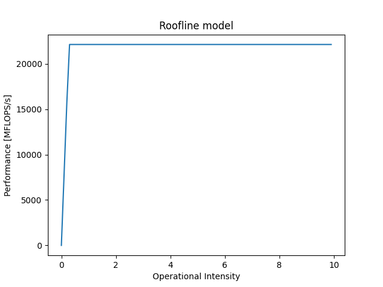

# Labo 2 Miguel Jalube
## Topology
```bash
miguel@miguel-ROG-Strix-GA15DH-G15DH:~/Bureau/HPC$ likwid-topology
--------------------------------------------------------------------------------
CPU name:       AMD Ryzen 7 3700X 8-Core Processor             
CPU type:       AMD K17 (Zen2) architecture
CPU stepping:   0
********************************************************************************
Hardware Thread Topology
********************************************************************************
Sockets:                1
Cores per socket:       8
Threads per core:       2
--------------------------------------------------------------------------------
HWThread        Thread          Core            Socket          Available
0               0               0               0               *
1               0               1               0               *
2               0               2               0               *
3               0               3               0               *
4               0               4               0               *
5               0               5               0               *
6               0               6               0               *
7               0               7               0               *
8               1               0               0               *
9               1               1               0               *
10              1               2               0               *
11              1               3               0               *
12              1               4               0               *
13              1               5               0               *
14              1               6               0               *
15              1               7               0               *
--------------------------------------------------------------------------------
Socket 0:               ( 0 8 1 9 2 10 3 11 4 12 5 13 6 14 7 15 )
--------------------------------------------------------------------------------
********************************************************************************
Cache Topology
********************************************************************************
Level:                  1
Size:                   32 kB
Cache groups:           ( 0 8 ) ( 1 9 ) ( 2 10 ) ( 3 11 ) ( 4 12 ) ( 5 13 ) ( 6 14 ) ( 7 15 )
--------------------------------------------------------------------------------
Level:                  2
Size:                   512 kB
Cache groups:           ( 0 8 ) ( 1 9 ) ( 2 10 ) ( 3 11 ) ( 4 12 ) ( 5 13 ) ( 6 14 ) ( 7 15 )
--------------------------------------------------------------------------------
Level:                  3
Size:                   16 MB
Cache groups:           ( 0 8 1 9 2 10 3 11 ) ( 4 12 5 13 6 14 7 15 )
--------------------------------------------------------------------------------
********************************************************************************
NUMA Topology
********************************************************************************
NUMA domains:           1
--------------------------------------------------------------------------------
Domain:                 0
Processors:             ( 0 8 1 9 2 10 3 11 4 12 5 13 6 14 7 15 )
Distances:              10
Free memory:            8803.57 MB
Total memory:           15913.4 MB
--------------------------------------------------------------------------------
```

## Roofline model
### maxperf et maxband
```bash
miguel@miguel-ROG-Strix-GA15DH-G15DH:~/Bureau/HPC$ likwid-bench -t load -W N:2GB:36 | grep -E 'MByte/s'
Running without Marker API. Activate Marker API with -m on commandline.
MByte/s:                22132.87
miguel@miguel-ROG-Strix-GA15DH-G15DH:~/Bureau/HPC$ likwid-bench -t peakflops -W N:360kB:36 | grep -E 'MFlops/s'
Running without Marker API. Activate Marker API with -m on commandline.
MFlops/s:               78444.70
```
Valeurs trouvées :
- maxband [MBytes/s] : 22132.87 
- maxperf [MFLOPS/s] : 78444.70

### computationnal intensity
Pour cette valeur je n'ai pas reussi à avoir la valeur correcte car j'avais une erreur lorsque je fesais la commande :
```bash
miguel@miguel-ROG-Strix-GA15DH-G15DH:~/Bureau/HPC/labo1/code/src$ sudo likwid-perfctr -C S0:0-3 -g FLOPS_SP -m ./lab01 
--------------------------------------------------------------------------------
CPU name:       AMD Ryzen 7 3700X 8-Core Processor             
CPU type:       AMD K17 (Zen2) architecture
CPU clock:      3.59 GHz
ERROR - [./src/includes/perfmon_zen2.h:zen2_pmc_setup:105] No such file or directory.
MSR write operation failed
ERROR - [./src/includes/perfmon_zen2.h:perfmon_setupCounterThread_zen2:223] No such file or directory.
MSR write operation failed
ERROR - [./src/includes/perfmon_zen2.h:zen2_pmc_setup:105] No such file or directory.
MSR write operation failed
ERROR - [./src/includes/perfmon_zen2.h:perfmon_setupCounterThread_zen2:223] No such file or directory.
MSR write operation failed
ERROR - [./src/includes/perfmon_zen2.h:zen2_pmc_setup:105] No such file or directory.
MSR write operation failed
ERROR - [./src/includes/perfmon_zen2.h:perfmon_setupCounterThread_zen2:223] No such file or directory.
MSR write operation failed
ERROR - [./src/includes/perfmon_zen2.h:zen2_pmc_setup:105] No such file or directory.
MSR write operation failed
ERROR - [./src/includes/perfmon_zen2.h:perfmon_setupCounterThread_zen2:223] No such file or directory.
MSR write operation failed
--------------------------------------------------------------------------------
ERROR - [./src/includes/perfmon_zen2.h:zen2_pmc_setup:105] No such file or directory.
MSR write operation failed
ERROR - [./src/includes/perfmon_zen2.h:perfmon_setupCounterThread_zen2:223] No such file or directory.
MSR write operation failed
ERROR - [./src/includes/perfmon_zen2.h:zen2_pmc_setup:105] No such file or directory.
MSR write operation failed
ERROR - [./src/includes/perfmon_zen2.h:perfmon_setupCounterThread_zen2:223] No such file or directory.
MSR write operation failed
ERROR - [./src/includes/perfmon_zen2.h:zen2_pmc_setup:105] No such file or directory.
MSR write operation failed
ERROR - [./src/includes/perfmon_zen2.h:perfmon_setupCounterThread_zen2:223] No such file or directory.
MSR write operation failed
ERROR - [./src/includes/perfmon_zen2.h:zen2_pmc_setup:105] No such file or directory.
MSR write operation failed
ERROR - [./src/includes/perfmon_zen2.h:perfmon_setupCounterThread_zen2:223] No such file or directory.
MSR write operation failed
ERROR - [./src/includes/perfmon_zen2.h:perfmon_startCountersThread_zen2:275] No such file or directory.
MSR write operation failed
--------------------------------------------------------------------------------
Region grayscale, Group 1: FLOPS_SP
+-------------------+------------+
|    Region Info    | HWThread 0 |
+-------------------+------------+
| RDTSC Runtime [s] |   0.002145 |
|     call count    |          1 |
+-------------------+------------+

+---------------------------+---------+------------+
|           Event           | Counter | HWThread 0 |
+---------------------------+---------+------------+
|      ACTUAL_CPU_CLOCK     |  FIXC1  |          0 |
|       MAX_CPU_CLOCK       |  FIXC2  |          0 |
|    RETIRED_INSTRUCTIONS   |   PMC0  |          0 |
|    CPU_CLOCKS_UNHALTED    |   PMC1  |      -     |
| RETIRED_SSE_AVX_FLOPS_ALL |   PMC2  |      -     |
|           MERGE           |   PMC3  |      -     |
+---------------------------+---------+------------+

+----------------------+------------+
|        Metric        | HWThread 0 |
+----------------------+------------+
|  Runtime (RDTSC) [s] |     0.0021 |
| Runtime unhalted [s] |          0 |
|      Clock [MHz]     |      -     |
|          CPI         |      -     |
|     SP [MFLOP/s]     |          0 |
+----------------------+------------+

ERROR - [./src/includes/perfmon_zen2.h:perfmon_finalizeCountersThread_zen2:530] No such file or directory.
MSR write operation failed
ERROR - [./src/includes/perfmon_zen2.h:perfmon_finalizeCountersThread_zen2:530] No such file or directory.
MSR write operation failed
ERROR - [./src/includes/perfmon_zen2.h:perfmon_finalizeCountersThread_zen2:530] No such file or directory.
MSR write operation failed
ERROR - [./src/includes/perfmon_zen2.h:perfmon_finalizeCountersThread_zen2:530] No such file or directory.
MSR write operation failed
```



## Groupe de performance custom
```
SHORT Ops Intensity

EVENTSET
FIXC1 ACTUAL_CPU_CLOCK
FIXC2 MAX_CPU_CLOCK
PMC0  RETIRED_INSTRUCTIONS
PMC1  CPU_CLOCKS_UNHALTED
PMC2  RETIRED_SSE_AVX_FLOPS_ALL
PMC3  MERGE

METRICS
Runtime (RDTSC) [s] time
Runtime unhalted [s]   FIXC1*inverseClock
Clock [MHz]  1.E-06*(FIXC1/FIXC2)/inverseClock
CPI   PMC1/PMC0
SP [MFLOP/s]   1.0E-06*(PMC2)/time

LONG
Formulas:
CPI = CPU_CLOCKS_UNHALTED/RETIRED_INSTRUCTIONS
SP [MFLOP/s] = 1.0E-06*(RETIRED_SSE_AVX_FLOPS_ALL)/time
-
Profiling group to measure (single-precisision) FLOP rate. The event might
have a higher per-cycle increment than 15, so the MERGE event is required. In
contrast to AMD Zen, the Zen2 microarchitecture does not provide events to
differentiate between single- and double-precision.
```

