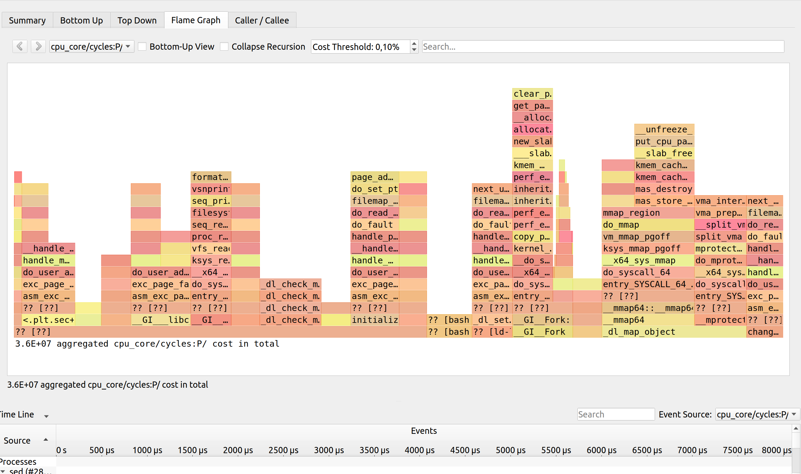

# Labo 5 HPC - Miguel Jalube - 13.05.2024

## Objectif
L’objectif de ce laboratoire est de se familiariser avec des outils de profiling afin d’analyser les performances
d’un programme. Pour cela, vous aller utiliser les outls proposé pour profiler des programmes.

## Architecture utilisée
```bash
miguel@miguel-Yoga-7-14IAL7:~$ lscpu
Architecture :                              x86_64
  Mode(s) opératoire(s) des processeurs :   32-bit, 64-bit
  Address sizes:                            39 bits physical, 48 bits virtual
  Boutisme :                                Little Endian
Processeur(s) :                             16
  Liste de processeur(s) en ligne :         0-15
Identifiant constructeur :                  GenuineIntel
  Nom de modèle :                           12th Gen Intel(R) Core(TM) i7-1260P
    Famille de processeur :                 6
    Modèle :                                154
    Thread(s) par cœur :                    2
    Cœur(s) par socket :                    12
    Socket(s) :                             1
    Révision :                              3
    Vitesse maximale du processeur en MHz : 4700.0000
    Vitesse minimale du processeur en MHz : 400.0000
    BogoMIPS :                              4992.00

```

Voici un aperçu des details d'un des coeurs du processeur de la machine utilisée, sachant que le processeu a 16 coeurs :

```bash
miguel@miguel-Yoga-7-14IAL7:~$ cat /proc/cpuinfo
processor       : 0
vendor_id       : GenuineIntel
cpu family      : 6
model           : 154
model name      : 12th Gen Intel(R) Core(TM) i7-1260P
stepping        : 3
microcode       : 0x430
cpu MHz         : 983.942
cache size      : 18432 KB
physical id     : 0
siblings        : 16
core id         : 0
cpu cores       : 12
apicid          : 0
initial apicid  : 0
fpu             : yes
fpu_exception   : yes
cpuid level     : 32
wp              : yes
flags           : fpu vme de pse tsc msr pae mce cx8 apic sep mtrr pge mca cmov pat pse36 clflush dts acpi mmx fxsr sse sse2 ss ht tm pbe syscall nx pdpe1gb rdtscp lm constant_tsc art arch_perfmon pebs bts rep_good nopl xtopology nonstop_tsc cpuid aperfmperf tsc_known_freq pni pclmulqdq dtes64 monitor ds_cpl vmx smx est tm2 ssse3 sdbg fma cx16 xtpr pdcm sse4_1 sse4_2 x2apic movbe popcnt tsc_deadline_timer aes xsave avx f16c rdrand lahf_lm abm 3dnowprefetch cpuid_fault epb ssbd ibrs ibpb stibp ibrs_enhanced tpr_shadow flexpriority ept vpid ept_ad fsgsbase tsc_adjust bmi1 avx2 smep bmi2 erms invpcid rdseed adx smap clflushopt clwb intel_pt sha_ni xsaveopt xsavec xgetbv1 xsaves split_lock_detect avx_vnni dtherm ida arat pln pts hwp hwp_notify hwp_act_window hwp_epp hwp_pkg_req hfi vnmi umip pku ospke waitpkg gfni vaes vpclmulqdq rdpid movdiri movdir64b fsrm md_clear serialize arch_lbr ibt flush_l1d arch_capabilities
vmx flags       : vnmi preemption_timer posted_intr invvpid ept_x_only ept_ad ept_1gb flexpriority apicv tsc_offset vtpr mtf vapic ept vpid unrestricted_guest vapic_reg vid ple shadow_vmcs ept_mode_based_exec tsc_scaling usr_wait_pause
bugs            : spectre_v1 spectre_v2 spec_store_bypass swapgs eibrs_pbrsb
bogomips        : 4992.00
clflush size    : 64
cache_alignment : 64
address sizes   : 39 bits physical, 48 bits virtual
power management:
```

Une 
• La description détaillé de l’utilisation que vous allez profiler (baseline).
• Si vous avez dû effectuer des manipulations spéciales pour l’installation (non décrites dans le
README du projet), expliquez-les.
• Une analyse approfondie des résultats obtenus avec les outils. Appuyé par des screenshots,
des graphiques ou autres.
• Une conclusion sur les résultats
• Enfin, proposer une amélioration et pouvoir la démontrer.
3

## Introduction sur le projet choisi
Le programme utilisé lors du labo est un outil pour faire du grascale comme le laboratoire 1. Le programme est particulier car après la compilation il génère un script imagew qui lance le programe. Le fichier binaire se trouve dans un dossier caché .libs/imagew. Toute fois il est possible de profiler le programme en utilisant le script imagew.

Repo github : https://github.com/jsummers/imageworsener.git 

## Utilisation profilée (baseline)
Le programme est utilisé pour convertir des images en noir et blanc comme pour le labo 1. Pour cela on utilise la commande suivante :
```bash
$ ./imagew -grayscale tests/srcimg/<input_img>.<format> <output_img>.<format>
```

## Compilation
Pour compiler le programme il faut :
1. Executer le script :
```bash
$ ./scripts/autogen.sh
```
2. Executer le script :
```bash
$ ./configure
```
3. Dans le dossier `scripts` faire `make`
4. Dans le repertoire root du projet faire `make`

Le fichier executable est un script shell `imagew` qui fait appel au binaire `imagew` dans le dossier `.libs/imagew`

## Perf stat
Image : 4x4.png
Perf :
```bash
miguel@miguel-Yoga-7-14IAL7:~/Bureau/HPC/labos_HPC/lab5/imageworsener-master$ perf stat -e cpu-clock ./imagew -grayscale tests/srcimg/4x4.png output.png
tests/srcimg/4x4.png → output.png
Processing: 4×4

 Performance counter stats for './imagew -grayscale tests/srcimg/4x4.png output.png':

             23.74 msec cpu-clock                        #    1.042 CPUs utilized             

       0.022782125 seconds time elapsed

       0.012407000 seconds user
       0.013928000 seconds sys
```

Image : rings1.png
Perf :
```bash
miguel@miguel-Yoga-7-14IAL7:~/Bureau/HPC/labos_HPC/lab5/imageworsener-master$ perf stat -e cpu-clock ./imagew -grayscale tests/srcimg/rings1.png rings1_gray.png
tests/srcimg/rings1.png → rings1_gray.png
Processing: 107×107

 Performance counter stats for './imagew -grayscale tests/srcimg/rings1.png rings1_gray.png':

             27.26 msec cpu-clock                        #    1.030 CPUs utilized             

       0.026462403 seconds time elapsed

       0.022610000 seconds user
       0.007811000 seconds sys
```

Image : nyc.png
Perf :
```bash
miguel@miguel-Yoga-7-14IAL7:~/Bureau/HPC/labos_HPC/lab5/imageworsener-master$ perf stat -e cpu-clock ./imagew -grayscale tests/srcimg/nyc.png nyc_gray.png
tests/srcimg/nyc.png → nyc_gray.png
Processing: 1150×710

 Performance counter stats for './imagew -grayscale tests/srcimg/nyc.png nyc_gray.png':

            468.00 msec cpu-clock                        #    1.003 CPUs utilized             

       0.466522620 seconds time elapsed

       0.450746000 seconds user
       0.019722000 seconds sys
```

## Flamegraph

1. Le flamegraph va être sur la même execution que perf. Pour commencer il faut generer un rapport avec perf :

```bash
# Génère un fichier perf.data en output
sudo perf record -g ./imagew -grayscale tests/srcimg/4x4.png output.png
```
2. Ouvrir hotspot `sudo hotspot` depuis le même dossier ou se trouve `perf.data`

3. Aller dans l'onglet "Flame Graph"


Le flamegraph affiché n'est pas facilement comprehensible. On ne retrouve pas les fonctions qui proviennent des sources malgré le fait d'avoir compilé le programme avec les symboles. Même en cherchant dans les sources on ne retrouve pas non plus les fonctions du Flame Graph

## Valgrind
Pour profiler avec Valgrind executer les commandes suivantes depuis la racine du programme:
```bash
    $ valgrind --trace-children=yes --tool=callgrind ./imagew -filter gaussian tests/srcimg/4x4.png output.png
```

Cela va générer plusieurs fichiers de nom `callgrind.out.<pid>`. Beaucoup de ces fichiers concernent le linker et ne nous interessent pas. Pour trouver le PID du fichier qui nous interesse il faut le trouver dans l'output de la commande précédente. La ligne à laquelle il se trouve ressemble à :
```bash
  ==12692== Command: /home/miguel/Bureau/HPC/labos_HPC/lab5/imageworsener-master/.libs/imagew -filter gaussian tests/srcimg/4x4.png output.png
```
Le PID pour cet exemple est 12692. Pour visualiser le fichier `callgrind.out.12692` il faut executer la commande suivante :

```bash
$ kcachegrind callgrind.out.12692
```

## Optimisations
### Loop unrolling
Fichier : `imageworsener-master/src/imagew-api.c`
ligne : 219
Description : Ce n'est pas tout à fait un loop unrolling mais au lieu de faire un for loop pour initialiser les valeurs à 0, on utilise la fonction `memset` qui est plus rapide.
```c
	// Optimized with memset
	/*for(i=0;i<3;i++) {
		rs->channel_offset[i] = 0.0;
	}*/
	memset(rs->channel_offset, 0.0, 3);
```

### Vectorisation
Fichier : `imageworsener-master/src/imagew-png.c`
ligne : 788
Description : On utilise des vecteurs de 128 bits pour stocker les valeurs de `bpr` et `i` et on les multiplie pour obtenir les offsets. On stocke ensuite les résultats dans `row_pointers`.
La fonction génère une erreur en provenance de la librairie `smmintrin.h`.
```c

  #include <emmintrin.h> // Pour les intrinsics SSE2
  #include <smmintrin.h>

  // To SIMD
	// Did not work
	/*for(i=0;i<pw->img.height;i++) {
		pw->row_pointers[i] = &pw->img.pixels[pw->img.bpr*i];
	}*/

	__m128i vec_bpr = _mm_set1_epi32(pw->img.bpr);
    for (i = 0; i <= pw->img.height - 4; i += 4) {
        // Crée un vecteur contenant {i, i+1, i+2, i+3}
        __m128i vec_i = _mm_add_epi32(_mm_set1_epi32(i), _mm_setr_epi32(0, 1, 2, 3));

        // Multiplie le vecteur vec_i par bpr pour obtenir les décalages
        __m128i vec_offsets = _mm_mullo_epi32(vec_i, vec_bpr);

        // Stocke les résultats dans row_pointers
        for (int j = 0; j < 4; ++j) {
            int offset = _mm_extract_epi32(vec_offsets, j);
            pw->row_pointers[i + j] = &pw->img.pixels[offset];
        }
    }
    // Traiter les éléments restants
    for (; i < pw->img.height; ++i) {
        pw->row_pointers[i] = &pw->img.pixels[pw->img.bpr * i];
    }
```

### Branchements
Fichier : `imageworsener-master/src/imagew-api.c`
ligne : 200
Description : On remplace les branchements par des opérations logiques pour optimiser le code.

```c
  // To optimize
	/*if(density_x<0.0001 || density_y<0.0001) return 0;
	if(density_x>10000000.0 || density_y>10000000.0) return 0;
	if(density_x/10.0>density_y) return 0;
	if(density_y/10.0>density_x) return 0;
	if(density_code!=IW_DENSITY_UNITS_UNKNOWN && density_code!=IW_DENSITY_UNITS_PER_METER)
		return 0;
	return 1;
	*/
	int res =   density_x<0.0001 || density_y<0.0001 || density_x>10000000.0 || 
              density_y>10000000.0 || density_x/10.0>density_y || density_y/10.0>density_x || density_code!=IW_DENSITY_UNITS_UNKNOWN && density_code!=IW_DENSITY_UNITS_PER_METER;
	return !res;
```

### Autres optimisations
Compilation en -O3

### Profiling post optimisations
Image : 4x4.png
Resultat :
```bash
miguel@miguel-Yoga-7-14IAL7:~/Bureau/HPC/labos_HPC/lab5/imageworsener-master$ perf stat -e cpu-clock ./imagew -grayscale tests/srcimg/4x4.png output.png
tests/srcimg/4x4.png → output.png
Processing: 4×4

 Performance counter stats for './imagew -grayscale tests/srcimg/4x4.png output.png':

             21.72 msec cpu-clock                        #    1.034 CPUs utilized             

       0.021001794 seconds time elapsed

       0.022123000 seconds user
       0.002405000 seconds sys
```

Image : rings1.png
Resultat :
```bash
miguel@miguel-Yoga-7-14IAL7:~/Bureau/HPC/labos_HPC/lab5/imageworsener-master$ perf stat -e cpu-clock ./imagew -grayscale tests/srcimg/rings1.png rings1_gray.png
tests/srcimg/rings1.png → rings1_gray.png
Processing: 107×107

 Performance counter stats for './imagew -grayscale tests/srcimg/rings1.png rings1_gray.png':

             12.80 msec cpu-clock                        #    1.032 CPUs utilized             

       0.012406649 seconds time elapsed

       0.010226000 seconds user
       0.004176000 seconds sys
```

Image : nyc.png
Resultat :
```bash
miguel@miguel-Yoga-7-14IAL7:~/Bureau/HPC/labos_HPC/lab5/imageworsener-master$ perf stat -e cpu-clock ./imagew -grayscale tests/srcimg/nyc.png nyc_gray.png
tests/srcimg/nyc.png → nyc_gray.png
Processing: 1150×710

 Performance counter stats for './imagew -grayscale tests/srcimg/nyc.png nyc_gray.png':

            462.84 msec cpu-clock                        #    0.999 CPUs utilized             

       0.463069638 seconds time elapsed

       0.446215000 seconds user
       0.018645000 seconds sys
```

Tableau de comparaison des temps d'execution :

| Image | Dimensions | Avant optimisation | Après optimisation | Pourcentage de gain |
|-------|------------|--------------------|--------------------|---------------------|
| 4x4.png | 4x4 | 23.74 ms | 21.72 ms | 8.51 % |
| rings1.png | 107x107 | 27.26 ms | 12.80 ms | 53.01 % |
| nyc.png | 1150x710 | 468.00 ms | 462.84 ms | 1.10 % |

## Conclusion
Les optimisations ont permis de gagner en performance. Les gains sont plus importants pour l'image de 107x107 pixels. Les optimisations ont permis de réduire le temps d'execution de 53.01%. Pour l'image de 4x4 pixels le gain est de 8.51% et pour l'image de 1150x710 pixels le gain est de 1.10%. Les optimisations ont été faites en utilisant des techniques de loop unrolling, de vectorisation et de réduction des branchements.


